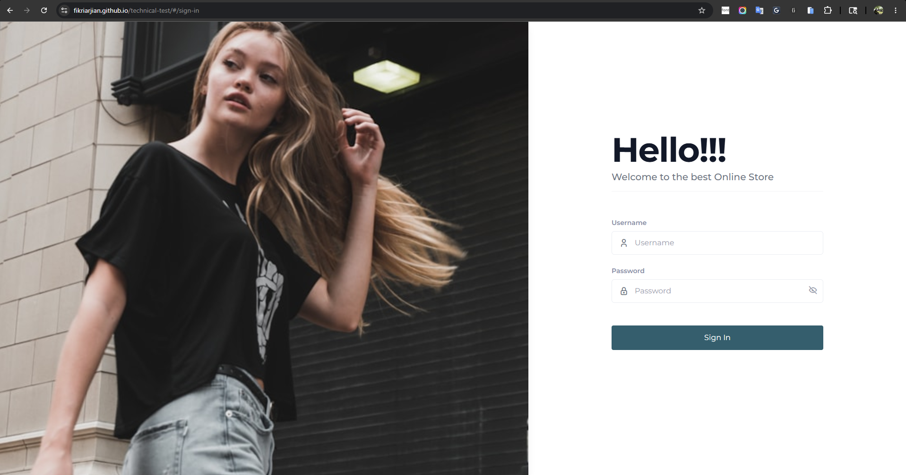
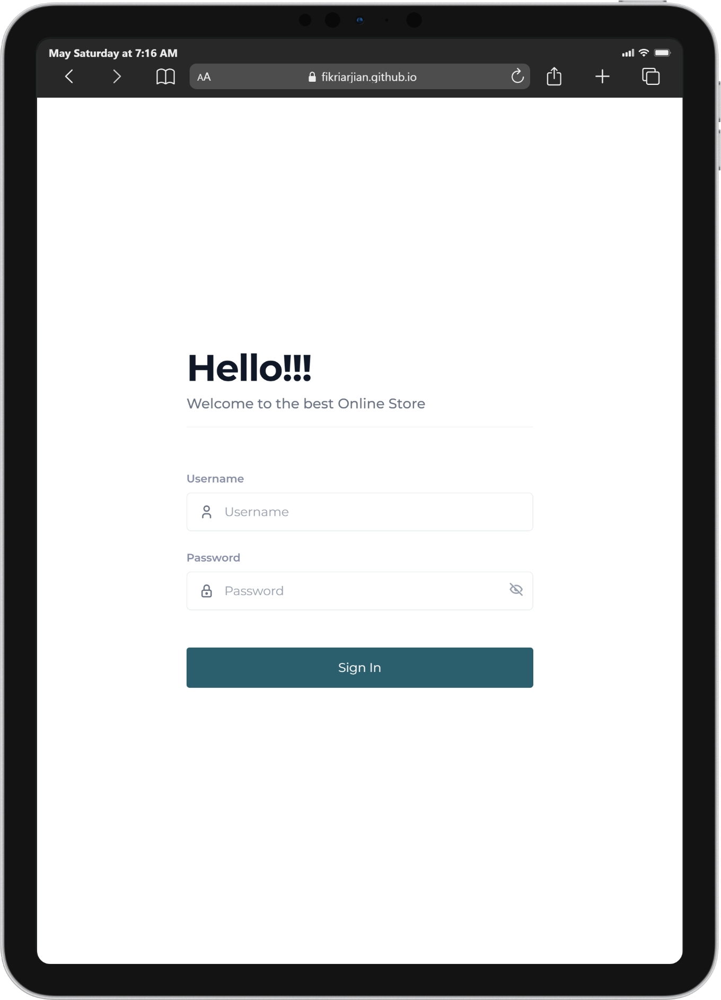
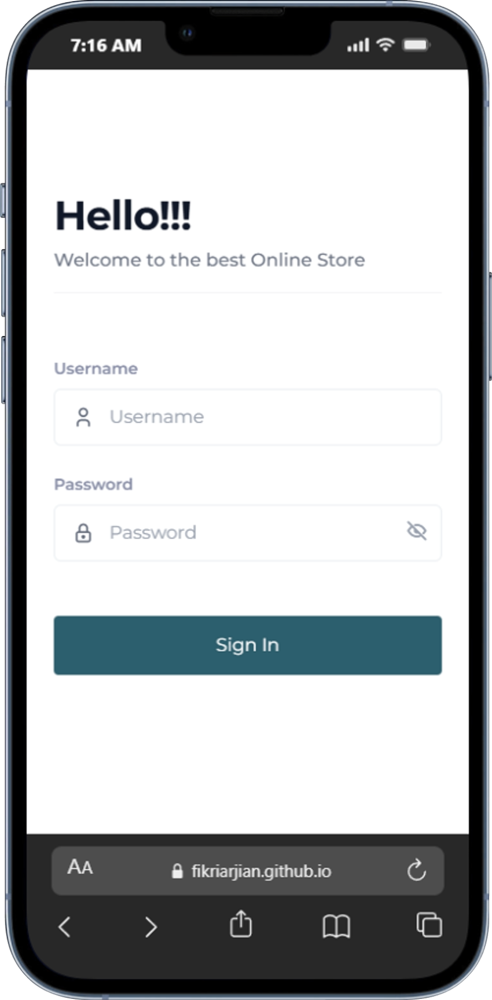
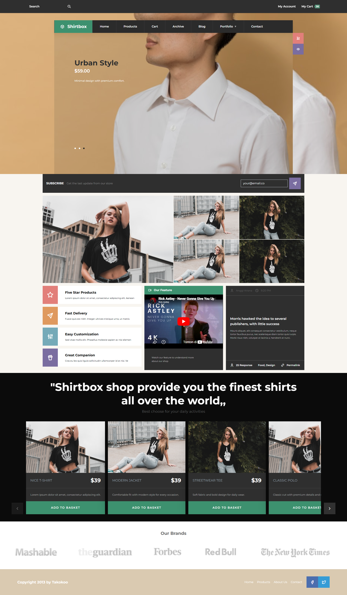
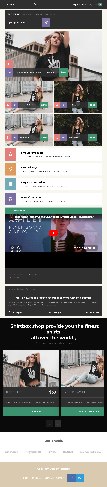
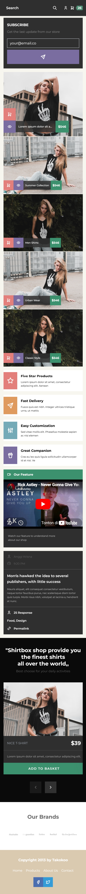

# Technical Test - Shirtbox Store

Aplikasi frontend e-commerce modern yang dibangun menggunakan Vue 3, Vite, TailwindCSS, dan Pinia.

---

# Live Demo

https://fikriarjian.github.io/technical-test/

---

# Teknologi yang Digunakan

- Vue 3
- TypeScript
- Vite
- Pinia
- Vue Router
- TailwindCSS
- Axios
- DummyJSON API
- GitHub Pages
- GitHub Actions

---

# Cara Menjalankan Project

## Clone Repository

```bash
git clone https://github.com/fikriarjian/technical-test.git
```

## Install Dependencies

```bash
npm install
```

## Menjalankan Development Server

```bash
npm run dev
```

## Build Project

```bash
npm run build
```

---

# Akun Login

Menggunakan akun dummy dari DummyJSON:

```text
username: emilys
password: emilyspass
```

Dokumentasi API:

https://dummyjson.com/docs/auth

---

# Struktur Folder

```text
src/
│
├── assets/          # Menyimpan gambar, icon, dan file assets
├── components/      # Reusable components
├── layouts/         # Layout aplikasi
├── router/          # Konfigurasi Vue Router
├── services/        # API service / axios setup
├── stores/          # State management Pinia
├── views/           # Halaman aplikasi
└── main.ts          # Entry point aplikasi
```

---

# Penjelasan Struktur Component

Project menggunakan pendekatan component-based architecture agar code lebih modular dan reusable.

Contoh struktur:

```text
views/
└── dashboard/
    ├── Dashboard.vue
    └── components/
        ├── HeroSlider.vue
        ├── ProductSlider.vue
        ├── Brands.vue
        └── ProductSection.vue
```

## Strategi Struktur

- Reusable UI diletakkan pada `components/ui`
- Component spesifik halaman diletakkan dekat dengan view terkait
- Layout dipisahkan antara halaman auth dan dashboard
- State management dipusatkan menggunakan Pinia

---

# Penjelasan Responsive Strategy

Responsive design dibuat menggunakan utility class dari TailwindCSS.

## Strategi yang Digunakan

- Menggunakan pendekatan mobile-first
- `sm:` untuk tablet
- `md:` untuk medium device
- `lg:` untuk desktop

Contoh:

```html
<div class="grid grid-cols-1 md:grid-cols-2 lg:grid-cols-4">
```

## Penyesuaian Responsive

- Navigation diubah menjadi stack layout pada mobile
- Slider menyesuaikan viewport mobile
- Ukuran button disesuaikan untuk device kecil
- Footer dan section tertentu berubah menjadi column layout pada mobile

---

# Penjelasan Login Flow

1. User memasukkan username dan password
2. Request dikirim ke DummyJSON API
3. API mengembalikan token dan data user
4. Token disimpan pada localStorage
5. User diarahkan ke dashboard
6. Route protection dilakukan menggunakan Vue Router middleware

---

# Penjelasan Token / Session Handling

## Authentication

- Token disimpan di localStorage
- Authorization header otomatis dipasang menggunakan Axios
- Session dicek melalui router middleware

## Auto Logout

Jika API mengembalikan status:

```text
401 Unauthorized
```

maka:
- Session otomatis dihapus
- User diarahkan kembali ke halaman login

---

# Deployment

Project dideploy menggunakan:

- GitHub Pages
- GitHub Actions

Deployment otomatis berjalan setiap ada push ke branch:

```text
main
```

---

# Penggunaan AI Tools

AI tools digunakan sebagai bantuan selama proses development, terutama untuk:

- Penyesuaian responsive layout
- Optimasi TailwindCSS
- Setup GitHub Actions deployment
- Perbaikan struktur component Vue
- Debugging router dan authentication
- Pembuatan dokumentasi README

## Bagian yang Dibantu AI

AI digunakan sebagai assistant development untuk membantu:
- Memberikan saran implementasi
- Membantu troubleshooting
- Membantu optimasi struktur code

Sedangkan implementasi akhir, integrasi, dan penyesuaian tetap dilakukan secara manual selama proses development.

---

# Preview













---

# Author

Fikri Arjian Nugraha